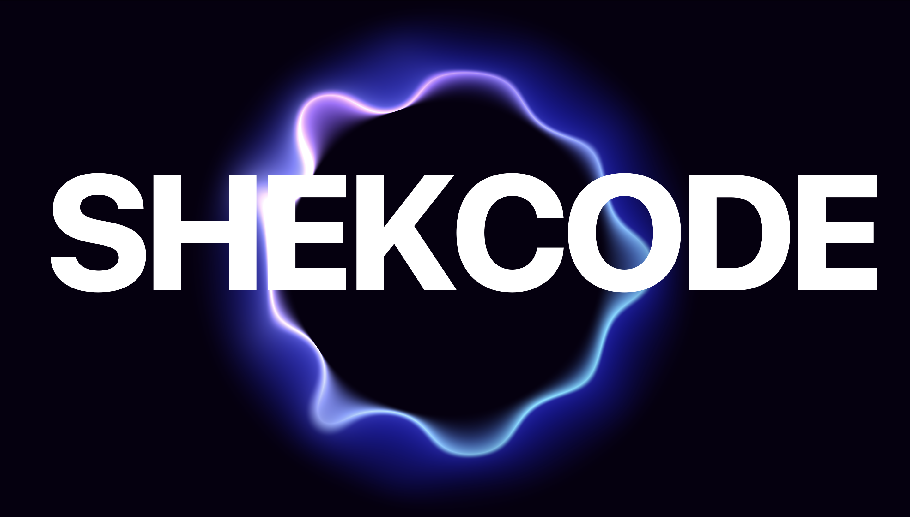

# SHEKCODE PORTFOLIO

Welcome to my personal portfolio repository! Here, you will find a collection of my projects, skills, and experiences that showcase my journey as a frontend developer.



Check it out live: https://shekcodes.vercel.app/

## About Me

Hi! I’m Patricia Kanneh, a frontend developer from Ghana with a passion for creating clean, responsive, and interactive web experiences. I love using modern technologies like React, TypeScript, and TailwindCSS to build projects that are both visually appealing and performant.

I’m always exploring new tools, learning best practices, and building projects that solve real-world problems.

## Features of the Portfolio

- **Showcase of projects**: Explore my work with links and project descriptions.
- **Interactive UI**: Smooth animations and responsive design for all devices.
- **Modern stack**: Built with React 18, TypeScript,Framer Motion, 3D animation, Three.js and TailwindCSS.
- **Contact section**: Easy way to reach out via LinkedIn, GitHub, or email.

## Technologies Used

• Frontend: React 18, TypeScript, TailwindCSS, Framer Motion, Thress.js
• Deployment: Vercel
• Other Tools: ESLint, Prettier, Git/GitHub

## Projects Featured

Some highlights include:

- **CalBuy Modern E-commerce Site**: Production-ready e-commerce platform with real-time store integration and secure payments.

- **Swagha Sports**: Sports media platform with dynamic content, smooth animations, and responsive UI.

- **Rehoboth Florals**: Modern floral e-commerce site with backend integration and smooth user flow.

- **Ricair Travel Site**: Clean travel consultation website with dynamic content and backend-powered booking forms.

- **ShekCodes Portfolio**: Personal portfolio showcasing frontend and fullstack projects with interactive UI

- **Other Projects**: Space Tourism Experience, AI ChatBot, Gemini AI ChatBot Clone etc.

(For full list and live demos, visit the portfolio site.)

## Clone the repository

```
git clone https://github.com/shekinahwebdev/SHEKCODES
cd my-portfolio

```

## Install dependencies

```
npm install

```

# Run locally

```
npm run dev
```

Contact Me
• LinkedIn: https://linkedin.com/in/patricia-kanneh-20a200293/
• GitHub: https://github.com/shekinahwebdev
• Email: patriciashilohkanneh12@gmail.com

## License

This project is open source and free to use under the MIT License.
